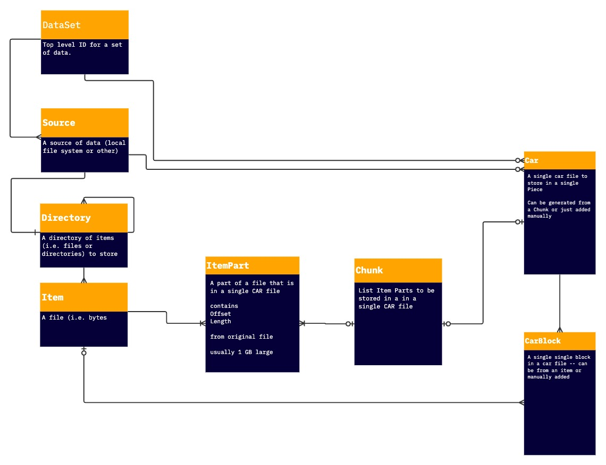

# Architecture of data preparation in Singularity

# Datasets And Sources

A dataset is set of data with common policies for replication and one or more associated Filecoin wallets.

Every data set can have one or more sources for data. A source is simply a pointer to a folder of data, that can be stored on storage supported by [RClone](https://github.com/rclone/rclone), including local file storage.

Data preparation begins a singularity user:
1. Creates a dataset
2. Adds a source to the dataset
3. Starts the data prepartation worker

# Scanning

The first stage of data preparation is to scan a datasource to build a directory tree structure of the files and folders it contains as well as a plan for how to chunk up the files inside into CAR files.

The models used to represent the directory tree structure of a data source are Directory and Item. (where directory is a folder and item is a file) During the scanning process, RClone is used to map the directory structure of the data source, and then Directory and Item models are assembled from this directory structure, starting from the root Directory for the data source, which was created at the time the data source is registered.

For each Item in the data source, the scanning process also creates ItemParts, which represent contiguous portions of the file up to 1GB (this size can be configured). Additionally sets of ItemParts are added to a Chunk, which is simply a list of ItemParts that will go into a single CAR file large enough to store in a 32GB piece on Filecoin.

At the end of the scanning process, we end up with a tree of Directories, each with a list of Items, each of which are broken up into ItemParts representing portions of each file up to 1GB. Additionally, we have a set of Chunks, which each link to a set of ItemParts (enough to fill a piece) that we will pack together into a single CAR file.

Note that since data sources can change, they can also be rescanned as files and folders are added, changed, and deleted.

# Packing

Once a source is scanned, it's ready to be packed into a CAR file. Packing is the process of converting Chunks into actual written CAR files with individual blocks.

To pack a car file, each ItemPart in a Chunk is read and chunked into IPLD Raw blocks of a specified block size, each of which is written to the CAR. After all the raw blocks are written, assuming the ItemPart contained more than one raw block, a tree of UnixFS intermediate node blocks are assembled and written to link the raw blocks together and produce a root CID for the item part. When this process is completed, we have a car file that contains the raw blocks and UnixFS intermediate node blocks for all the ItemParts in the Chunk.

At the end of the packing process, Singularity also writes a Car model to its database to represent the Car file, as well as a CarBlock for every block in the CAR. 

As we finish writing each Car, we return to our Directories and Items. For each Item that has all of its ItemParts written, we build an additional UnixFS intermediate node tree to connect all of the ItemParts in a Item into a single UnixFS file for the item. We also assemble and update UnixFS directory nodes for each Directory. This data is stored in a temporary blockstore linked to Directory objects.

When the packing process is done, we have CAR files to store every ItemPart in a data source. However, note that at this point, while we've also assembled a UnixFS DAG that represents the directories (Directories) and files (Items) from the data source, we haven't serialized it to its own CAR to store on Filecoin.

# Daggen

Because files and directory structures can change over time, storing a snapshot of this structure into Filecoin is a manual preparation step called Daggen. When a user initiates this step seperately, the UnixFS DAG tree assembled during Pack but not written to a CAR is serialized into a CAR to be stored on Filecoin. Once this is done, if we store every CAR written in the data prep process onto Filecoin, we will have stored everything needed to retrieve an entire snapshot of the data source from Filecoin